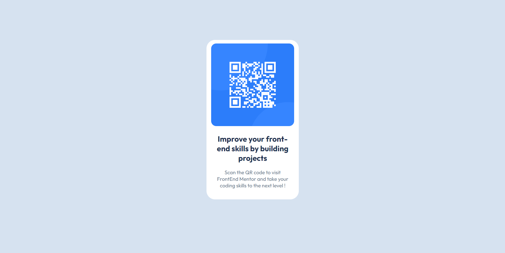
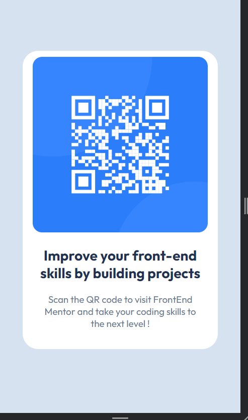

# Frontend Mentor - QR code component solution

This is a solution to the [QR code component challenge on Frontend Mentor](https://www.frontendmentor.io/challenges/qr-code-component-iux_sIO_H). Frontend Mentor challenges help you improve your coding skills by building realistic projects. 

## Table of contents

- [Overview](#overview)
  - [Screenshot](#screenshot)
  - [Links](#links)
- [My process](#my-process)
  - [Built with](#built-with)
  - [What I learned](#what-i-learned)
  - [Continued development](#continued-development)
- [Author](#author)

**Note: Delete this note and update the table of contents based on what sections you keep.**

## Overview

### Screenshot



### Links

Hosted on Github Pages : https://jallahlog.github.io/Frontend-Mentor----QR-code-component/

## My process

Made the structure, then styled it. Not really much to say about.

### Built with

- Semantic HTML5 markup
- CSS custom properties
- Flexbox
- Mobile-first workflow ? I dont really know tbh
- Google Fonts

### What I learned

Learned media queries :
```css
@media (max-width: 758px) {
    #square {
        width:90%;
    }
}
```
Learned about rem, vmax units. Kinda some things about flexbox too.

### Continued development

Responsive web-design. I feel like this is really poor, as it scales only starting from a starting breakdown of px. 

## Author

- Discord : kxs16e9
